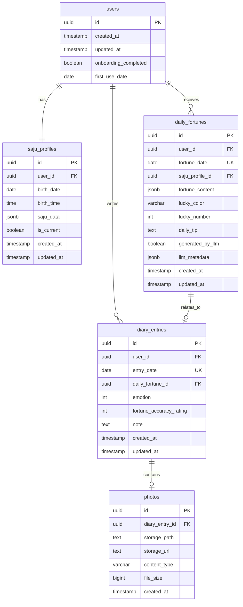

# 데일리 사주 운세 & 감정 다이어리 ERD (Entity-Relationship Diagram) 문서

## 1. 데이터베이스 개요

### 1.1 시스템 요약

**데일리 사주 운세 & 감정 다이어리**는 1인 사용자를 위한 웹 기반 개인 운세 및 감정 기록 서비스입니다.

**핵심 데이터 요구사항**:
- 사용자의 생년월일시 기반 사주팔자 프로필 저장
- 매일의 운세 생성 및 캐싱 (LLM 토큰 절약)
- 일기 기록 (사진 1장 + 감정 아이콘 1개)
- 캘린더 뷰를 위한 히스토리 데이터 조회

**데이터베이스 플랫폼**: Supabase (PostgreSQL 14+)

### 1.2 설계 원칙

1. **단순성 우선**: 1인 사용자를 위한 최소 복잡도
2. **확장 가능성**: 향후 멀티 유저 전환 가능한 구조
3. **정규화**: 3NF 수준 유지, 필요시 선택적 비정규화
4. **성능**: 적절한 인덱싱으로 빠른 조회
5. **보안**: PII 데이터 보호, RLS 준비

### 1.3 단일 사용자 가정

v1에서는 단일 사용자를 가정하지만, 모든 테이블에 `user_id` 필드를 포함하여 향후 멀티 유저 전환 시 최소한의 마이그레이션만 필요하도록 설계합니다.

**v1 사용자 식별자**: 
- 고정 UUID (예: `'00000000-0000-0000-0000-000000000001'`)
- 또는 Supabase에서 생성한 첫 번째 사용자 ID

---

## 2. ERD 다이어그램 (Mermaid)



---

## 3. 엔티티 정의 (Entity Definitions)

### 3.1 users (사용자)

**목적**: 시스템 사용자를 식별하는 기본 엔티티. v1에서는 단일 레코드만 존재.

**비즈니스 규칙**:
- v1: 정확히 1개의 레코드만 존재
- v2 (멀티 유저): 회원가입 시 레코드 생성
- 사용자 삭제 시 모든 관련 데이터 cascade 삭제

**특징**:
- Supabase Auth와 통합 가능 (향후)
- 온보딩 완료 여부 추적

### 3.2 saju_profiles (사주 프로필)

**목적**: 사용자의 생년월일시 기반 사주팔자 계산 결과 저장.

**비즈니스 규칙**:
- 사용자당 최소 1개의 활성 프로필 필요
- 생년월일시 수정 시 새 레코드 생성, 이전 레코드는 `is_current = false`로 변경
- 버전 히스토리 유지 (선택적)

**특징**:
- `saju_data`: 천간, 지지, 오행 등 계산된 사주 데이터 (JSONB)
- `is_current`: 현재 활성 프로필 표시 (단일 사용자의 경우 최신 1개만 true)

### 3.3 daily_fortunes (일일 운세)

**목적**: 날짜별 생성된 운세 캐싱. LLM 중복 호출 방지.

**비즈니스 규칙**:
- 사용자당 날짜당 최대 1개 레코드 (UNIQUE 제약)
- 같은 날짜에 재접속 시 기존 레코드 재사용
- 운세 생성 후 수정 불가 (읽기 전용)

**특징**:
- `fortune_content`: 카테고리별 운세 텍스트 (JSONB)
  ```json
  {
    "재물운": "오늘은 예상치 못한 수입이...",
    "연애운": "소중한 사람과의 대화가...",
    "건강운": "컨디션 관리에 신경 써야..."
  }
  ```
- `llm_metadata`: LLM 호출 정보 (모델명, 토큰 수 등)
- 토큰 절약을 위한 핵심 테이블

### 3.4 diary_entries (일기 기록)

**목적**: 날짜별 사용자의 감정 및 간단한 기록 저장.

**비즈니스 규칙**:
- 사용자당 날짜당 최대 1개 레코드 (UNIQUE 제약)
- 운세 없이 일기만 작성 가능 (daily_fortune_id NULL 허용)
- 일기 수정 가능 (덮어쓰기)

**특징**:
- `emotion`: 1~5 정수 (1=매우 나쁨, 5=매우 좋음)
- `fortune_accuracy_rating`: 운세 정확도 평가 (1~5 또는 NULL)
- `note`: 짧은 텍스트 메모 (선택적, 향후 확장용)

### 3.5 photos (사진)

**목적**: Supabase Storage에 업로드된 사진 메타데이터 저장.

**비즈니스 규칙**:
- 일기 엔트리당 최대 1개 사진 (v1)
- 향후 1:N 관계로 확장 가능하도록 설계
- 일기 삭제 시 사진 레코드도 삭제 (Storage 파일도 삭제 필요)

**특징**:
- `storage_path`: Supabase Storage 내 경로 (예: `diary-photos/2025-01-29-abc123.jpg`)
- `storage_url`: 접근 가능한 URL (Signed URL)
- v1에서는 공개 버킷 대신 private 버킷 + Signed URL 권장

---

## 4. 속성 명세 (Attribute Specifications)

### 4.1 users 테이블

| 컬럼명 | 데이터 타입 | NULL 허용 | 기본값 | 제약조건 | 설명 |
|--------|------------|----------|--------|---------|------|
| id | uuid | NO | gen_random_uuid() | PK | 사용자 고유 식별자 |
| created_at | timestamp with time zone | NO | now() | | 사용자 생성 시각 (첫 사용 시각) |
| updated_at | timestamp with time zone | NO | now() | | 마지막 업데이트 시각 |
| onboarding_completed | boolean | NO | false | | 사주 프로필 설정 완료 여부 |
| first_use_date | date | YES | NULL | | 첫 사용 날짜 (통계용) |

**인덱스**:
- PRIMARY KEY: `id`

**Note**: 
- v1에서는 레코드 1개만 존재
- Supabase Auth 통합 시 `auth.users`와 외래키 연결 가능
- PII 데이터 없음 (생년월일시는 `saju_profiles`에 저장)

### 4.2 saju_profiles 테이블

| 컬럼명 | 데이터 타입 | NULL 허용 | 기본값 | 제약조건 | 설명 |
|--------|------------|----------|--------|---------|------|
| id | uuid | NO | gen_random_uuid() | PK | 사주 프로필 고유 식별자 |
| user_id | uuid | NO | | FK → users(id) | 사용자 참조 |
| birth_date | date | NO | | | **생년월일 (PII)** |
| birth_time | time | NO | | | **출생 시간 (PII)** |
| saju_data | jsonb | NO | | | 계산된 사주 데이터 (천간/지지/오행 등) |
| is_current | boolean | NO | true | | 현재 활성 프로필 여부 |
| created_at | timestamp with time zone | NO | now() | | 프로필 생성 시각 |
| updated_at | timestamp with time zone | NO | now() | | 마지막 업데이트 시각 |

**인덱스**:
- PRIMARY KEY: `id`
- INDEX: `user_id, is_current` (현재 프로필 빠른 조회)

**제약조건**:
- FOREIGN KEY: `user_id` REFERENCES `users(id)` ON DELETE CASCADE
- UNIQUE: `(user_id, is_current)` WHERE `is_current = true` (사용자당 활성 프로필 1개만)

**saju_data JSONB 구조 예시**:
```json
{
  "year_pillar": {"천간": "갑", "지지": "자", "오행": "목"},
  "month_pillar": {"천간": "병", "지지": "인", "오행": "화"},
  "day_pillar": {"천간": "무", "지지": "오", "오행": "토"},
  "hour_pillar": {"천간": "경", "지지": "신", "오행": "금"},
  "element_distribution": {
    "금": 1,
    "목": 1,
    "수": 0,
    "화": 1,
    "토": 1
  },
  "dominant_element": "목"
}
```

**Note**: 
- 생년월일시는 민감한 PII로 취급
- RLS 정책으로 접근 제한 필수 (멀티 유저 전환 시)
- 프로필 수정 시 기존 레코드 비활성화, 새 레코드 생성 (히스토리 유지)

### 4.3 daily_fortunes 테이블

| 컬럼명 | 데이터 타입 | NULL 허용 | 기본값 | 제약조건 | 설명 |
|--------|------------|----------|--------|---------|------|
| id | uuid | NO | gen_random_uuid() | PK | 운세 레코드 고유 식별자 |
| user_id | uuid | NO | | FK → users(id) | 사용자 참조 |
| fortune_date | date | NO | | UK (with user_id) | 운세 날짜 |
| saju_profile_id | uuid | NO | | FK → saju_profiles(id) | 사용된 사주 프로필 참조 |
| fortune_content | jsonb | NO | | | 카테고리별 운세 텍스트 |
| lucky_color | varchar(50) | YES | NULL | | 행운의 색상 (예: "파란색") |
| lucky_number | integer | YES | NULL | CHECK (1-99) | 행운의 숫자 (1~99) |
| daily_tip | text | YES | NULL | | 오늘의 팁 (시간대 조언 등) |
| generated_by_llm | boolean | NO | true | | LLM으로 생성 여부 |
| llm_metadata | jsonb | YES | NULL | | LLM 호출 메타데이터 |
| created_at | timestamp with time zone | NO | now() | | 운세 생성 시각 |
| updated_at | timestamp with time zone | NO | now() | | 마지막 업데이트 시각 |

**인덱스**:
- PRIMARY KEY: `id`
- UNIQUE INDEX: `(user_id, fortune_date)` (사용자당 날짜당 1개만)
- INDEX: `fortune_date DESC` (최근 운세 빠른 조회)
- INDEX: `user_id, fortune_date` (복합 조회)

**제약조건**:
- FOREIGN KEY: `user_id` REFERENCES `users(id)` ON DELETE CASCADE
- FOREIGN KEY: `saju_profile_id` REFERENCES `saju_profiles(id)` ON DELETE SET NULL
- CHECK: `lucky_number BETWEEN 1 AND 99`

**fortune_content JSONB 구조 예시**:
```json
{
  "재물운": "오늘은 예상치 못한 수입이 생길 가능성이 높습니다. 투자보다는 저축에 집중하세요.",
  "연애운": "소중한 사람과의 대화가 깊어질 수 있는 날입니다. 진솔한 마음을 전하세요.",
  "건강운": "컨디션 관리에 신경 써야 합니다. 충분한 수면과 가벼운 운동을 권장합니다."
}
```

**llm_metadata JSONB 구조 예시**:
```json
{
  "model": "claude-sonnet-4-20250514",
  "prompt_tokens": 450,
  "completion_tokens": 280,
  "total_tokens": 730,
  "generation_time_ms": 3200,
  "timestamp": "2025-01-29T09:15:00Z"
}
```

**Note**: 
- 토큰 절약의 핵심: 같은 날짜 재방문 시 DB 조회만
- LLM 비용 추적을 위한 메타데이터 저장
- 운세는 생성 후 수정하지 않음 (불변 데이터)

### 4.4 diary_entries 테이블

| 컬럼명 | 데이터 타입 | NULL 허용 | 기본값 | 제약조건 | 설명 |
|--------|------------|----------|--------|---------|------|
| id | uuid | NO | gen_random_uuid() | PK | 일기 레코드 고유 식별자 |
| user_id | uuid | NO | | FK → users(id) | 사용자 참조 |
| entry_date | date | NO | | UK (with user_id) | 일기 날짜 |
| daily_fortune_id | uuid | YES | NULL | FK → daily_fortunes(id) | 해당 날짜 운세 참조 (선택적) |
| emotion | integer | NO | | CHECK (1-5) | 감정 (1=매우 나쁨 ~ 5=매우 좋음) |
| fortune_accuracy_rating | integer | YES | NULL | CHECK (1-5) | 운세 정확도 평가 (선택적) |
| note | text | YES | NULL | | 짧은 메모 (선택적, 향후 확장용) |
| created_at | timestamp with time zone | NO | now() | | 일기 생성 시각 |
| updated_at | timestamp with time zone | NO | now() | | 마지막 업데이트 시각 |

**인덱스**:
- PRIMARY KEY: `id`
- UNIQUE INDEX: `(user_id, entry_date)` (사용자당 날짜당 1개만)
- INDEX: `entry_date DESC` (최근 일기 빠른 조회)
- INDEX: `user_id, entry_date` (복합 조회)
- INDEX: `emotion` (감정별 통계 조회)

**제약조건**:
- FOREIGN KEY: `user_id` REFERENCES `users(id)` ON DELETE CASCADE
- FOREIGN KEY: `daily_fortune_id` REFERENCES `daily_fortunes(id)` ON DELETE SET NULL
- CHECK: `emotion BETWEEN 1 AND 5`
- CHECK: `fortune_accuracy_rating IS NULL OR (fortune_accuracy_rating BETWEEN 1 AND 5)`

**감정 값 매핑**:
| 값 | 이모티콘 | 의미 |
|----|---------|------|
| 1 | 😢 | 매우 나쁨 |
| 2 | 😞 | 나쁨 |
| 3 | 😐 | 보통 |
| 4 | 🙂 | 좋음 |
| 5 | 😄 | 매우 좋음 |

**Note**: 
- 운세 없이 일기만 작성 가능 (daily_fortune_id NULL)
- 일기는 덮어쓰기 가능 (UPDATE 허용)
- 감정 통계를 위한 인덱스 포함

### 4.5 photos 테이블

| 컬럼명 | 데이터 타입 | NULL 허용 | 기본값 | 제약조건 | 설명 |
|--------|------------|----------|--------|---------|------|
| id | uuid | NO | gen_random_uuid() | PK | 사진 레코드 고유 식별자 |
| diary_entry_id | uuid | NO | | FK → diary_entries(id) | 일기 참조 |
| storage_path | text | NO | | | Supabase Storage 경로 |
| storage_url | text | YES | NULL | | 접근 가능 URL (Signed URL) |
| content_type | varchar(100) | NO | | | MIME 타입 (예: image/jpeg) |
| file_size | bigint | YES | NULL | CHECK (> 0) | 파일 크기 (바이트) |
| created_at | timestamp with time zone | NO | now() | | 사진 업로드 시각 |

**인덱스**:
- PRIMARY KEY: `id`
- INDEX: `diary_entry_id` (일기별 사진 조회)

**제약조건**:
- FOREIGN KEY: `diary_entry_id` REFERENCES `diary_entries(id)` ON DELETE CASCADE
- CHECK: `file_size > 0`
- CHECK: `content_type IN ('image/jpeg', 'image/png', 'image/webp', 'image/heic')`

**storage_path 명명 규칙**:
```
diary-photos/{user_id}/{YYYY-MM-DD}-{timestamp}.{ext}
예: diary-photos/00000000-0000-0000-0000-000000000001/2025-01-29-1706512800000.jpg
```

**Note**: 
- v1: 일기당 사진 1개 (1:1 관계)
- v2: 일기당 여러 사진 가능하도록 이미 1:N 구조
- 일기 삭제 시 CASCADE로 레코드 삭제 + Storage 파일 수동 삭제 필요
- Private bucket 사용, Signed URL로 접근 제어

---

## 5. 관계 매핑 (Relationship Mappings)

### 5.1 관계 요약 테이블

| 부모 엔티티 | 자식 엔티티 | 관계 타입 | 카디널리티 | 외래키 | 설명 |
|------------|------------|---------|----------|--------|------|
| users | saju_profiles | 1:N | 1명의 사용자 → N개 프로필 | saju_profiles.user_id | 버전 히스토리 지원 |
| users | daily_fortunes | 1:N | 1명의 사용자 → N개 운세 | daily_fortunes.user_id | 날짜별 운세 |
| users | diary_entries | 1:N | 1명의 사용자 → N개 일기 | diary_entries.user_id | 날짜별 일기 |
| saju_profiles | daily_fortunes | 1:N | 1개 프로필 → N개 운세 | daily_fortunes.saju_profile_id | 어느 프로필로 생성되었는지 추적 |
| daily_fortunes | diary_entries | 1:1 | 1개 운세 ↔ 1개 일기 | diary_entries.daily_fortune_id | 선택적 연결 (NULL 가능) |
| diary_entries | photos | 1:N | 1개 일기 → N개 사진 | photos.diary_entry_id | v1은 1개, 향후 확장 가능 |

### 5.2 상세 관계 설명

#### 5.2.1 users ↔ saju_profiles (1:N)

```sql
-- 한 사용자는 여러 사주 프로필을 가질 수 있음 (버전 히스토리)
-- 하지만 is_current = true인 프로필은 1개만 존재
SELECT * FROM saju_profiles 
WHERE user_id = '...' AND is_current = true;
```

**비즈니스 규칙**:
- 사용자가 생년월일시를 수정하면 새 프로필 생성
- 기존 프로필은 `is_current = false`로 변경
- 삭제는 하지 않음 (히스토리 유지)

#### 5.2.2 users ↔ daily_fortunes (1:N)

```sql
-- 한 사용자는 날짜별로 여러 운세를 받음
-- 하지만 날짜당 1개만 (UNIQUE 제약)
SELECT * FROM daily_fortunes 
WHERE user_id = '...' AND fortune_date = '2025-01-29';
```

**비즈니스 규칙**:
- 같은 날짜 재방문 시 기존 운세 재사용
- 운세 삭제 시 관련 일기의 `daily_fortune_id`는 NULL로 변경

#### 5.2.3 saju_profiles ↔ daily_fortunes (1:N)

```sql
-- 하나의 사주 프로필로 여러 날짜의 운세 생성
-- 프로필 변경 후에도 과거 운세는 어느 프로필로 생성되었는지 추적
SELECT * FROM daily_fortunes 
WHERE saju_profile_id = '...';
```

**비즈니스 규칙**:
- 사주 프로필 변경 후 새 운세는 새 프로필 ID 사용
- 과거 운세는 그대로 유지 (변경하지 않음)

#### 5.2.4 daily_fortunes ↔ diary_entries (1:1, 선택적)

```sql
-- 하나의 운세와 하나의 일기가 날짜로 연결
-- 하지만 일기만 단독으로 존재 가능 (daily_fortune_id NULL)
SELECT 
  de.*,
  df.fortune_content,
  df.lucky_color
FROM diary_entries de
LEFT JOIN daily_fortunes df ON de.daily_fortune_id = df.id
WHERE de.entry_date = '2025-01-29';
```

**비즈니스 규칙**:
- 일반적으로 운세와 일기는 같은 날짜에 1:1 매칭
- 운세 없이 일기만 작성 가능
- 운세 삭제 시 일기는 유지, 참조만 NULL

#### 5.2.5 diary_entries ↔ photos (1:N)

```sql
-- v1: 일기당 사진 1개
-- v2: 일기당 여러 사진 가능
SELECT * FROM photos 
WHERE diary_entry_id = '...'
LIMIT 1; -- v1에서는 1개만
```

**비즈니스 규칙**:
- v1: 애플리케이션 레벨에서 1개만 허용
- v2: LIMIT 제거, 여러 사진 업로드 가능
- 일기 삭제 시 사진 레코드도 CASCADE 삭제

---

## 6. 기본키/외래키 구조 (Primary/Foreign Key Structure)

### 6.1 기본키 (Primary Keys)

모든 테이블은 `uuid` 타입의 `id` 컬럼을 기본키로 사용합니다.

```sql
-- 기본키 생성 예시
CREATE TABLE users (
  id uuid PRIMARY KEY DEFAULT gen_random_uuid(),
  -- ...
);
```

**UUID 사용 이유**:
- 분산 시스템에서 충돌 없이 고유 ID 생성
- 보안: 순차 ID 대비 추측 불가능
- Supabase 권장 패턴

### 6.2 외래키 (Foreign Keys)

#### 6.2.1 외래키 정의

```sql
-- saju_profiles 테이블
ALTER TABLE saju_profiles
  ADD CONSTRAINT fk_saju_profiles_user
  FOREIGN KEY (user_id) 
  REFERENCES users(id) 
  ON DELETE CASCADE;

-- daily_fortunes 테이블
ALTER TABLE daily_fortunes
  ADD CONSTRAINT fk_daily_fortunes_user
  FOREIGN KEY (user_id) 
  REFERENCES users(id) 
  ON DELETE CASCADE;

ALTER TABLE daily_fortunes
  ADD CONSTRAINT fk_daily_fortunes_saju_profile
  FOREIGN KEY (saju_profile_id) 
  REFERENCES saju_profiles(id) 
  ON DELETE SET NULL;

-- diary_entries 테이블
ALTER TABLE diary_entries
  ADD CONSTRAINT fk_diary_entries_user
  FOREIGN KEY (user_id) 
  REFERENCES users(id) 
  ON DELETE CASCADE;

ALTER TABLE diary_entries
  ADD CONSTRAINT fk_diary_entries_daily_fortune
  FOREIGN KEY (daily_fortune_id) 
  REFERENCES daily_fortunes(id) 
  ON DELETE SET NULL;

-- photos 테이블
ALTER TABLE photos
  ADD CONSTRAINT fk_photos_diary_entry
  FOREIGN KEY (diary_entry_id) 
  REFERENCES diary_entries(id) 
  ON DELETE CASCADE;
```

#### 6.2.2 삭제 동작 (ON DELETE)

| 외래키 | ON DELETE 동작 | 이유 |
|--------|---------------|------|
| saju_profiles.user_id | CASCADE | 사용자 삭제 시 모든 프로필 삭제 |
| daily_fortunes.user_id | CASCADE | 사용자 삭제 시 모든 운세 삭제 |
| daily_fortunes.saju_profile_id | SET NULL | 프로필 삭제해도 과거 운세는 유지 |
| diary_entries.user_id | CASCADE | 사용자 삭제 시 모든 일기 삭제 |
| diary_entries.daily_fortune_id | SET NULL | 운세 삭제해도 일기는 유지 |
| photos.diary_entry_id | CASCADE | 일기 삭제 시 사진도 삭제 |

**Note**: 
- CASCADE: 부모 삭제 시 자식도 함께 삭제
- SET NULL: 부모 삭제 시 자식의 참조만 NULL로 변경

### 6.3 고유 제약 (Unique Constraints)

```sql
-- 사용자당 날짜당 운세 1개만
ALTER TABLE daily_fortunes
  ADD CONSTRAINT uq_daily_fortunes_user_date
  UNIQUE (user_id, fortune_date);

-- 사용자당 날짜당 일기 1개만
ALTER TABLE diary_entries
  ADD CONSTRAINT uq_diary_entries_user_date
  UNIQUE (user_id, entry_date);

-- 사용자당 활성 프로필 1개만 (부분 인덱스)
CREATE UNIQUE INDEX uq_saju_profiles_user_current
  ON saju_profiles (user_id, is_current)
  WHERE is_current = true;
```

---

## 7. 인덱스 전략 (Index Strategy)

### 7.1 인덱스 목록

#### 7.1.1 users 테이블

```sql
-- 기본키 (자동 생성)
-- PRIMARY KEY 인덱스: id
```

**조회 패턴**: 단일 사용자만 조회하므로 추가 인덱스 불필요

#### 7.1.2 saju_profiles 테이블

```sql
-- 현재 활성 프로필 빠른 조회
CREATE INDEX idx_saju_profiles_user_current 
  ON saju_profiles (user_id, is_current);

-- 생성 시간순 정렬 (히스토리 조회)
CREATE INDEX idx_saju_profiles_created 
  ON saju_profiles (user_id, created_at DESC);
```

**조회 패턴**:
```sql
-- 현재 프로필 조회 (매일 운세 생성 시)
SELECT * FROM saju_profiles 
WHERE user_id = ? AND is_current = true;

-- 프로필 히스토리 조회 (설정 화면)
SELECT * FROM saju_profiles 
WHERE user_id = ? 
ORDER BY created_at DESC;
```

#### 7.1.3 daily_fortunes 테이블

```sql
-- 사용자별 날짜별 고유 인덱스 (중복 방지 + 빠른 조회)
CREATE UNIQUE INDEX uq_daily_fortunes_user_date 
  ON daily_fortunes (user_id, fortune_date);

-- 최근 운세 조회 (캘린더 뷰)
CREATE INDEX idx_daily_fortunes_date_desc 
  ON daily_fortunes (user_id, fortune_date DESC);

-- 사주 프로필별 운세 조회 (프로필 변경 추적)
CREATE INDEX idx_daily_fortunes_saju_profile 
  ON daily_fortunes (saju_profile_id);
```

**조회 패턴**:
```sql
-- 오늘 운세 존재 여부 확인 (가장 빈번)
SELECT * FROM daily_fortunes 
WHERE user_id = ? AND fortune_date = CURRENT_DATE;

-- 최근 30일 운세 조회 (캘린더 뷰)
SELECT fortune_date, lucky_color, lucky_number 
FROM daily_fortunes 
WHERE user_id = ? 
  AND fortune_date >= CURRENT_DATE - INTERVAL '30 days'
ORDER BY fortune_date DESC;
```

#### 7.1.4 diary_entries 테이블

```sql
-- 사용자별 날짜별 고유 인덱스
CREATE UNIQUE INDEX uq_diary_entries_user_date 
  ON diary_entries (user_id, entry_date);

-- 최근 일기 조회
CREATE INDEX idx_diary_entries_date_desc 
  ON diary_entries (user_id, entry_date DESC);

-- 감정별 통계 조회
CREATE INDEX idx_diary_entries_emotion 
  ON diary_entries (user_id, emotion);

-- 운세 연결 확인
CREATE INDEX idx_diary_entries_fortune 
  ON diary_entries (daily_fortune_id);
```

**조회 패턴**:
```sql
-- 오늘 일기 존재 여부
SELECT * FROM diary_entries 
WHERE user_id = ? AND entry_date = CURRENT_DATE;

-- 최근 30일 일기 + 감정
SELECT entry_date, emotion 
FROM diary_entries 
WHERE user_id = ? 
  AND entry_date >= CURRENT_DATE - INTERVAL '30 days'
ORDER BY entry_date DESC;

-- 감정별 통계
SELECT emotion, COUNT(*) as count
FROM diary_entries 
WHERE user_id = ? 
  AND entry_date >= CURRENT_DATE - INTERVAL '90 days'
GROUP BY emotion;
```

#### 7.1.5 photos 테이블

```sql
-- 일기별 사진 조회
CREATE INDEX idx_photos_diary_entry 
  ON photos (diary_entry_id);

-- 업로드 시간순 정렬 (선택적)
CREATE INDEX idx_photos_created 
  ON photos (created_at DESC);
```

**조회 패턴**:
```sql
-- 일기의 사진 조회
SELECT * FROM photos 
WHERE diary_entry_id = ?
LIMIT 1; -- v1은 1개만
```

### 7.2 인덱스 성능 고려사항

**인덱스 크기 vs 성능**:
- 테이블 크기: 수백~수천 행 (매우 작음)
- 인덱스 오버헤드: 거의 무시 가능
- 결론: 조회 성능 우선, 필요한 인덱스 모두 생성

**복합 인덱스 순서**:
- `(user_id, fortune_date)`: user_id로 먼저 필터링 후 날짜 검색
- `(user_id, is_current)`: 부분 인덱스로 최적화

**부분 인덱스 (Partial Index)**:
```sql
-- is_current = true인 행만 인덱싱 (공간 절약)
CREATE UNIQUE INDEX uq_saju_profiles_user_current
  ON saju_profiles (user_id, is_current)
  WHERE is_current = true;
```

---

## 8. 제약 조건 및 비즈니스 규칙 (Constraints and Business Rules)

### 8.1 체크 제약 (Check Constraints)

```sql
-- daily_fortunes: 행운의 숫자는 1~99
ALTER TABLE daily_fortunes
  ADD CONSTRAINT chk_lucky_number_range
  CHECK (lucky_number IS NULL OR (lucky_number BETWEEN 1 AND 99));

-- diary_entries: 감정은 1~5
ALTER TABLE diary_entries
  ADD CONSTRAINT chk_emotion_range
  CHECK (emotion BETWEEN 1 AND 5);

-- diary_entries: 정확도 평가는 1~5 또는 NULL
ALTER TABLE diary_entries
  ADD CONSTRAINT chk_fortune_accuracy_range
  CHECK (fortune_accuracy_rating IS NULL OR 
         (fortune_accuracy_rating BETWEEN 1 AND 5));

-- photos: 파일 크기는 양수
ALTER TABLE photos
  ADD CONSTRAINT chk_file_size_positive
  CHECK (file_size IS NULL OR file_size > 0);

-- photos: 허용된 이미지 타입만
ALTER TABLE photos
  ADD CONSTRAINT chk_content_type_valid
  CHECK (content_type IN ('image/jpeg', 'image/png', 'image/webp', 'image/heic'));
```

### 8.2 비즈니스 규칙 구현

#### 8.2.1 날짜 중복 방지

**규칙**: 사용자는 날짜당 운세 1개, 일기 1개만 가질 수 있음

**구현**:
```sql
-- UNIQUE 제약으로 DB 레벨에서 강제
ALTER TABLE daily_fortunes
  ADD CONSTRAINT uq_daily_fortunes_user_date
  UNIQUE (user_id, fortune_date);

ALTER TABLE diary_entries
  ADD CONSTRAINT uq_diary_entries_user_date
  UNIQUE (user_id, entry_date);
```

#### 8.2.2 활성 사주 프로필 단일성

**규칙**: 사용자당 is_current = true인 프로필은 1개만 존재

**구현**:
```sql
-- 부분 UNIQUE 인덱스
CREATE UNIQUE INDEX uq_saju_profiles_user_current
  ON saju_profiles (user_id, is_current)
  WHERE is_current = true;
```

**프로필 업데이트 로직** (애플리케이션 레벨):
```sql
BEGIN;
  -- 기존 프로필 비활성화
  UPDATE saju_profiles 
  SET is_current = false 
  WHERE user_id = ? AND is_current = true;
  
  -- 새 프로필 생성
  INSERT INTO saju_profiles (user_id, birth_date, birth_time, saju_data, is_current)
  VALUES (?, ?, ?, ?, true);
COMMIT;
```

#### 8.2.3 운세 재사용 (토큰 절약)

**규칙**: 같은 날짜의 운세는 1회만 생성, 이후 캐시 사용

**구현 로직** (애플리케이션):
```sql
-- 1. 오늘 운세 존재 여부 확인
SELECT id, fortune_content, lucky_color, lucky_number, daily_tip
FROM daily_fortunes
WHERE user_id = ? AND fortune_date = CURRENT_DATE;

-- 2-A. 있으면 → 그대로 사용 (LLM 호출 없음)
-- 2-B. 없으면 → LLM 호출 후 INSERT
INSERT INTO daily_fortunes (
  user_id, fortune_date, saju_profile_id, 
  fortune_content, lucky_color, lucky_number, daily_tip,
  generated_by_llm, llm_metadata
) VALUES (?, CURRENT_DATE, ?, ?, ?, ?, ?, true, ?);
```

#### 8.2.4 데이터 삭제 (초기화)

**규칙**: 사용자가 "모든 데이터 삭제" 실행 시 모든 관련 데이터 제거

**구현**:
```sql
-- 사용자 삭제 → CASCADE로 모든 데이터 자동 삭제
DELETE FROM users WHERE id = ?;

-- 또는 테이블별 개별 삭제
DELETE FROM photos WHERE diary_entry_id IN (
  SELECT id FROM diary_entries WHERE user_id = ?
);
DELETE FROM diary_entries WHERE user_id = ?;
DELETE FROM daily_fortunes WHERE user_id = ?;
DELETE FROM saju_profiles WHERE user_id = ?;
-- users는 유지하고 onboarding_completed = false로 리셋
UPDATE users SET onboarding_completed = false WHERE id = ?;
```

**Note**: Storage의 실제 파일 삭제는 애플리케이션에서 별도 처리 필요

### 8.3 트리거 (Triggers) - 선택적

#### 8.3.1 updated_at 자동 업데이트

```sql
-- 함수 생성
CREATE OR REPLACE FUNCTION update_updated_at_column()
RETURNS TRIGGER AS $$
BEGIN
  NEW.updated_at = NOW();
  RETURN NEW;
END;
$$ LANGUAGE plpgsql;

-- 트리거 적용
CREATE TRIGGER set_updated_at
BEFORE UPDATE ON users
FOR EACH ROW
EXECUTE FUNCTION update_updated_at_column();

-- 다른 테이블에도 동일 적용
CREATE TRIGGER set_updated_at BEFORE UPDATE ON saju_profiles FOR EACH ROW EXECUTE FUNCTION update_updated_at_column();
CREATE TRIGGER set_updated_at BEFORE UPDATE ON daily_fortunes FOR EACH ROW EXECUTE FUNCTION update_updated_at_column();
CREATE TRIGGER set_updated_at BEFORE UPDATE ON diary_entries FOR EACH ROW EXECUTE FUNCTION update_updated_at_column();
```

---

## 9. 데이터 타입 및 검증 규칙 (Data Types and Validation Rules)

### 9.1 PostgreSQL 데이터 타입 선택

| 컬럼 타입 | PostgreSQL 타입 | 이유 |
|----------|----------------|------|
| 고유 식별자 | `uuid` | 분산 환경 안전, 보안 |
| 날짜 | `date` | 시간 정보 불필요 |
| 시간 | `time` | 날짜 정보 불필요 |
| 타임스탬프 | `timestamp with time zone` | 시간대 고려 |
| JSON 데이터 | `jsonb` | 인덱싱 가능, 쿼리 성능 우수 |
| 짧은 문자열 | `varchar(n)` | 길이 제한 명확 |
| 긴 문자열 | `text` | 길이 제한 없음 |
| 정수 | `integer` | 표준 정수 타입 |
| 큰 정수 | `bigint` | 파일 크기 등 |
| 불린 | `boolean` | true/false |

### 9.2 JSONB 사용 가이드

**saju_data 구조**:
```json
{
  "year_pillar": {
    "천간": "갑",
    "지지": "자",
    "오행": "목",
    "십신": "비견"
  },
  "month_pillar": { /* 동일 구조 */ },
  "day_pillar": { /* 동일 구조 */ },
  "hour_pillar": { /* 동일 구조 */ },
  "element_distribution": {
    "금": 1,
    "목": 2,
    "수": 0,
    "화": 1,
    "토": 0
  },
  "dominant_element": "목",
  "calendar_type": "양력"
}
```

**JSONB 쿼리 예시**:
```sql
-- 특정 오행 추출
SELECT saju_data->'dominant_element' as dominant_element
FROM saju_profiles
WHERE user_id = ? AND is_current = true;

-- 오행 분포 필터링
SELECT * FROM saju_profiles
WHERE saju_data->'element_distribution'->>'목' = '2';
```

**fortune_content 구조**:
```json
{
  "재물운": "오늘은 예상치 못한 수입이 생길 가능성이 높습니다.",
  "연애운": "소중한 사람과의 대화가 깊어질 수 있는 날입니다.",
  "건강운": "컨디션 관리에 신경 써야 합니다.",
  "일운": "업무에서 좋은 성과를 낼 수 있는 날입니다." // 선택적
}
```

**llm_metadata 구조**:
```json
{
  "model": "claude-sonnet-4-20250514",
  "prompt_tokens": 450,
  "completion_tokens": 280,
  "total_tokens": 730,
  "generation_time_ms": 3200,
  "cost_usd": 0.00219,
  "timestamp": "2025-01-29T09:15:00Z"
}
```

### 9.3 검증 규칙

#### 9.3.1 애플리케이션 레벨 검증

```typescript
// 생년월일 검증
function validateBirthDate(date: Date): boolean {
  const minDate = new Date('1900-01-01');
  const maxDate = new Date(); // 오늘
  return date >= minDate && date <= maxDate;
}

// 출생 시간 검증
function validateBirthTime(time: string): boolean {
  const timeRegex = /^([01]\d|2[0-3]):([0-5]\d)$/;
  return timeRegex.test(time);
}

// 감정 값 검증
function validateEmotion(emotion: number): boolean {
  return Number.isInteger(emotion) && emotion >= 1 && emotion <= 5;
}

// 파일 크기 검증 (5MB)
function validateFileSize(size: number): boolean {
  const MAX_SIZE = 5 * 1024 * 1024; // 5MB
  return size > 0 && size <= MAX_SIZE;
}
```

#### 9.3.2 DB 레벨 검증 (CHECK 제약)

앞서 8.1절 참조

---

## 10. 정규화 분석 (Normalization Analysis)

### 10.1 현재 정규화 수준

**제1정규형 (1NF)**: ✅ 충족
- 모든 컬럼이 원자값 (JSONB는 PostgreSQL에서 원자값으로 취급)
- 각 행이 고유하게 식별됨 (PK 존재)

**제2정규형 (2NF)**: ✅ 충족
- 기본키가 단일 컬럼 (uuid)
- 부분 함수 종속성 없음

**제3정규형 (3NF)**: ✅ 충족
- 이행 함수 종속성 없음
- 모든 비키 속성이 기본키에만 종속

**보이스-코드 정규형 (BCNF)**: 대체로 충족
- 대부분의 테이블이 BCNF 만족
- JSONB 사용으로 일부 예외 존재 (의도적)

### 10.2 의도적 비정규화

#### 10.2.1 JSONB 사용

**테이블**: saju_profiles, daily_fortunes

**비정규화 이유**:
- 사주 데이터는 복잡한 계층 구조 (4개 기둥 × 여러 속성)
- 별도 테이블로 분리 시 JOIN 복잡도 증가
- 쿼리 빈도 낮음, 생성 후 거의 읽기 전용
- PostgreSQL JSONB는 인덱싱 및 쿼리 지원

**트레이드오프**:
- 장점: 스키마 간소화, 쿼리 단순화, 확장 용이
- 단점: JSON 내부 데이터 무결성 검증 어려움

#### 10.2.2 lucky_color, lucky_number 별도 컬럼

**테이블**: daily_fortunes

**대안**: fortune_content JSONB에 포함

**비정규화 선택 이유**:
- 자주 조회되는 필드 (캘린더 뷰)
- 인덱싱 및 필터링 용이
- 애플리케이션 로직 단순화

### 10.3 정규화 vs 성능 트레이드오프

**원칙**: 
- 기본은 3NF 유지
- 성능 향상 또는 쿼리 단순화에 명확한 이점이 있을 때만 비정규화
- 비정규화 시 문서화 필수

**예시**:
- `daily_fortunes.lucky_color` 별도 컬럼: 정당화됨 (자주 조회)
- `saju_profiles.saju_data` JSONB: 정당화됨 (복잡한 계층 구조)

---

## 11. 성능 최적화 고려사항 (Performance Optimization Considerations)

### 11.1 예상 쿼리 패턴

#### 11.1.1 오늘의 운세 조회 (최빈번)

```sql
-- 운세 존재 여부 확인 + 조회
SELECT 
  df.*,
  sp.saju_data
FROM daily_fortunes df
JOIN saju_profiles sp ON df.saju_profile_id = sp.id
WHERE df.user_id = '...' 
  AND df.fortune_date = CURRENT_DATE;

-- 인덱스: uq_daily_fortunes_user_date (UNIQUE INDEX)
-- 예상 성능: < 10ms
```

#### 11.1.2 오늘의 일기 조회

```sql
-- 일기 + 사진 함께 조회
SELECT 
  de.*,
  p.storage_url,
  p.content_type
FROM diary_entries de
LEFT JOIN photos p ON p.diary_entry_id = de.id
WHERE de.user_id = '...' 
  AND de.entry_date = CURRENT_DATE;

-- 인덱스: uq_diary_entries_user_date
-- 예상 성능: < 10ms
```

#### 11.1.3 월간 캘린더 데이터 조회

```sql
-- 특정 월의 모든 운세 + 일기 조회
SELECT 
  df.fortune_date,
  df.lucky_color,
  df.lucky_number,
  de.emotion,
  CASE WHEN p.id IS NOT NULL THEN true ELSE false END as has_photo
FROM daily_fortunes df
FULL OUTER JOIN diary_entries de 
  ON df.user_id = de.user_id AND df.fortune_date = de.entry_date
LEFT JOIN photos p ON p.diary_entry_id = de.id
WHERE df.user_id = '...' 
  AND df.fortune_date BETWEEN '2025-01-01' AND '2025-01-31'
ORDER BY df.fortune_date DESC;

-- 인덱스: idx_daily_fortunes_date_desc, idx_diary_entries_date_desc
-- 예상 성능: < 50ms (월 평균 30행)
```

#### 11.1.4 감정 통계 조회

```sql
-- 최근 3개월 감정 분포
SELECT 
  emotion,
  COUNT(*) as count,
  ROUND(COUNT(*) * 100.0 / SUM(COUNT(*)) OVER (), 2) as percentage
FROM diary_entries
WHERE user_id = '...'
  AND entry_date >= CURRENT_DATE - INTERVAL '90 days'
GROUP BY emotion
ORDER BY emotion;

-- 인덱스: idx_diary_entries_emotion
-- 예상 성능: < 20ms
```

### 11.2 쿼리 최적화 전략

#### 11.2.1 인덱스 활용

모든 주요 쿼리가 인덱스를 활용하도록 설계:
- 날짜 조회: UNIQUE INDEX (user_id, date)
- 범위 조회: INDEX (user_id, date DESC)
- 통계 조회: INDEX (user_id, emotion)

#### 11.2.2 JOIN 최소화

대부분 쿼리는 1~2개 테이블만 JOIN:
- 오늘 운세: 1개 테이블
- 오늘 일기: 2개 테이블 (diary + photo)
- 캘린더: 3개 테이블 (fortune + diary + photo)

#### 11.2.3 페이지네이션

월별 조회는 이미 자연스럽게 페이지네이션됨 (최대 31일)

향후 히스토리 조회 시:
```sql
-- LIMIT + OFFSET 사용
SELECT * FROM diary_entries
WHERE user_id = '...'
ORDER BY entry_date DESC
LIMIT 30 OFFSET 0;
```

### 11.3 캐싱 전략

#### 11.3.1 데이터베이스 캐싱

PostgreSQL 자체 캐시:
- 자주 조회되는 행은 메모리에 캐시됨
- 작은 데이터 볼륨으로 효과적

#### 11.3.2 애플리케이션 캐싱

```typescript
// 오늘의 운세는 클라이언트 메모리에 캐시
let todayFortuneCache: {
  date: string;
  data: Fortune;
} | null = null;

async function getTodayFortune(userId: string): Promise<Fortune> {
  const today = new Date().toISOString().split('T')[0];
  
  // 캐시 확인
  if (todayFortuneCache && todayFortuneCache.date === today) {
    return todayFortuneCache.data;
  }
  
  // DB 조회
  const fortune = await fetchFortuneFromDB(userId, today);
  
  // 캐시 저장
  todayFortuneCache = { date: today, data: fortune };
  
  return fortune;
}
```

#### 11.3.3 Supabase 실시간 구독 (선택적)

```typescript
// 데이터 변경 시 자동 갱신
const subscription = supabase
  .channel('diary-changes')
  .on('postgres_changes', {
    event: 'INSERT',
    schema: 'public',
    table: 'diary_entries'
  }, (payload) => {
    // UI 업데이트
  })
  .subscribe();
```

### 11.4 EXPLAIN 분석 예시

```sql
EXPLAIN ANALYZE
SELECT * FROM daily_fortunes
WHERE user_id = '00000000-0000-0000-0000-000000000001'
  AND fortune_date = '2025-01-29';

-- 예상 결과:
-- Index Scan using uq_daily_fortunes_user_date
-- (cost=0.15..8.17 rows=1) (actual time=0.025..0.026 rows=1)
```

---

## 12. 마이그레이션 및 버전 관리 전략 (Migration and Versioning Strategy)

### 12.1 초기 스키마 생성

#### 12.1.1 마이그레이션 파일 구조

```
migrations/
├── 001_create_users_table.sql
├── 002_create_saju_profiles_table.sql
├── 003_create_daily_fortunes_table.sql
├── 004_create_diary_entries_table.sql
├── 005_create_photos_table.sql
├── 006_create_indexes.sql
├── 007_create_constraints.sql
└── 008_create_triggers.sql
```

#### 12.1.2 001_create_users_table.sql

```sql
-- 사용자 테이블 생성
CREATE TABLE users (
  id uuid PRIMARY KEY DEFAULT gen_random_uuid(),
  created_at timestamp with time zone DEFAULT now() NOT NULL,
  updated_at timestamp with time zone DEFAULT now() NOT NULL,
  onboarding_completed boolean DEFAULT false NOT NULL,
  first_use_date date
);

-- RLS 활성화 (향후 멀티 유저 대비)
ALTER TABLE users ENABLE ROW LEVEL SECURITY;

-- v1: 모든 접근 허용
CREATE POLICY "Allow all for v1" ON users
  FOR ALL USING (true);

COMMENT ON TABLE users IS '사용자 기본 정보';
COMMENT ON COLUMN users.id IS '사용자 고유 식별자';
COMMENT ON COLUMN users.onboarding_completed IS '사주 프로필 설정 완료 여부';
```

#### 12.1.3 002_create_saju_profiles_table.sql

```sql
CREATE TABLE saju_profiles (
  id uuid PRIMARY KEY DEFAULT gen_random_uuid(),
  user_id uuid NOT NULL REFERENCES users(id) ON DELETE CASCADE,
  birth_date date NOT NULL,
  birth_time time NOT NULL,
  saju_data jsonb NOT NULL,
  is_current boolean DEFAULT true NOT NULL,
  created_at timestamp with time zone DEFAULT now() NOT NULL,
  updated_at timestamp with time zone DEFAULT now() NOT NULL
);

-- 인덱스
CREATE INDEX idx_saju_profiles_user_current 
  ON saju_profiles (user_id, is_current);

CREATE UNIQUE INDEX uq_saju_profiles_user_current
  ON saju_profiles (user_id, is_current)
  WHERE is_current = true;

-- RLS
ALTER TABLE saju_profiles ENABLE ROW LEVEL SECURITY;
CREATE POLICY "Allow all for v1" ON saju_profiles FOR ALL USING (true);

COMMENT ON TABLE saju_profiles IS '사용자 사주팔자 프로필';
COMMENT ON COLUMN saju_profiles.birth_date IS '생년월일 (PII)';
COMMENT ON COLUMN saju_profiles.birth_time IS '출생 시간 (PII)';
COMMENT ON COLUMN saju_profiles.saju_data IS '계산된 사주 데이터 (JSONB)';
```

#### 12.1.4 003_create_daily_fortunes_table.sql

```sql
CREATE TABLE daily_fortunes (
  id uuid PRIMARY KEY DEFAULT gen_random_uuid(),
  user_id uuid NOT NULL REFERENCES users(id) ON DELETE CASCADE,
  fortune_date date NOT NULL,
  saju_profile_id uuid REFERENCES saju_profiles(id) ON DELETE SET NULL,
  fortune_content jsonb NOT NULL,
  lucky_color varchar(50),
  lucky_number integer CHECK (lucky_number BETWEEN 1 AND 99),
  daily_tip text,
  generated_by_llm boolean DEFAULT true NOT NULL,
  llm_metadata jsonb,
  created_at timestamp with time zone DEFAULT now() NOT NULL,
  updated_at timestamp with time zone DEFAULT now() NOT NULL,
  CONSTRAINT uq_daily_fortunes_user_date UNIQUE (user_id, fortune_date)
);

-- 인덱스
CREATE INDEX idx_daily_fortunes_date_desc 
  ON daily_fortunes (user_id, fortune_date DESC);
CREATE INDEX idx_daily_fortunes_saju_profile 
  ON daily_fortunes (saju_profile_id);

-- RLS
ALTER TABLE daily_fortunes ENABLE ROW LEVEL SECURITY;
CREATE POLICY "Allow all for v1" ON daily_fortunes FOR ALL USING (true);

COMMENT ON TABLE daily_fortunes IS '날짜별 운세 캐시';
COMMENT ON COLUMN daily_fortunes.fortune_date IS '운세 날짜';
COMMENT ON COLUMN daily_fortunes.fortune_content IS '카테고리별 운세 텍스트 (JSONB)';
```

#### 12.1.5 004_create_diary_entries_table.sql

```sql
CREATE TABLE diary_entries (
  id uuid PRIMARY KEY DEFAULT gen_random_uuid(),
  user_id uuid NOT NULL REFERENCES users(id) ON DELETE CASCADE,
  entry_date date NOT NULL,
  daily_fortune_id uuid REFERENCES daily_fortunes(id) ON DELETE SET NULL,
  emotion integer NOT NULL CHECK (emotion BETWEEN 1 AND 5),
  fortune_accuracy_rating integer CHECK (
    fortune_accuracy_rating IS NULL OR 
    (fortune_accuracy_rating BETWEEN 1 AND 5)
  ),
  note text,
  created_at timestamp with time zone DEFAULT now() NOT NULL,
  updated_at timestamp with time zone DEFAULT now() NOT NULL,
  CONSTRAINT uq_diary_entries_user_date UNIQUE (user_id, entry_date)
);

-- 인덱스
CREATE INDEX idx_diary_entries_date_desc 
  ON diary_entries (user_id, entry_date DESC);
CREATE INDEX idx_diary_entries_emotion 
  ON diary_entries (user_id, emotion);
CREATE INDEX idx_diary_entries_fortune 
  ON diary_entries (daily_fortune_id);

-- RLS
ALTER TABLE diary_entries ENABLE ROW LEVEL SECURITY;
CREATE POLICY "Allow all for v1" ON diary_entries FOR ALL USING (true);

COMMENT ON TABLE diary_entries IS '날짜별 일기 기록';
COMMENT ON COLUMN diary_entries.emotion IS '감정 (1=매우 나쁨, 5=매우 좋음)';
```

#### 12.1.6 005_create_photos_table.sql

```sql
CREATE TABLE photos (
  id uuid PRIMARY KEY DEFAULT gen_random_uuid(),
  diary_entry_id uuid NOT NULL REFERENCES diary_entries(id) ON DELETE CASCADE,
  storage_path text NOT NULL,
  storage_url text,
  content_type varchar(100) NOT NULL CHECK (
    content_type IN ('image/jpeg', 'image/png', 'image/webp', 'image/heic')
  ),
  file_size bigint CHECK (file_size IS NULL OR file_size > 0),
  created_at timestamp with time zone DEFAULT now() NOT NULL
);

-- 인덱스
CREATE INDEX idx_photos_diary_entry ON photos (diary_entry_id);

-- RLS
ALTER TABLE photos ENABLE ROW LEVEL SECURITY;
CREATE POLICY "Allow all for v1" ON photos FOR ALL USING (true);

COMMENT ON TABLE photos IS '일기 사진 메타데이터';
COMMENT ON COLUMN photos.storage_path IS 'Supabase Storage 경로';
```

#### 12.1.7 008_create_triggers.sql

```sql
-- updated_at 자동 업데이트 함수
CREATE OR REPLACE FUNCTION update_updated_at_column()
RETURNS TRIGGER AS $$
BEGIN
  NEW.updated_at = NOW();
  RETURN NEW;
END;
$$ LANGUAGE plpgsql;

-- 트리거 생성
CREATE TRIGGER set_updated_at BEFORE UPDATE ON users
  FOR EACH ROW EXECUTE FUNCTION update_updated_at_column();

CREATE TRIGGER set_updated_at BEFORE UPDATE ON saju_profiles
  FOR EACH ROW EXECUTE FUNCTION update_updated_at_column();

CREATE TRIGGER set_updated_at BEFORE UPDATE ON daily_fortunes
  FOR EACH ROW EXECUTE FUNCTION update_updated_at_column();

CREATE TRIGGER set_updated_at BEFORE UPDATE ON diary_entries
  FOR EACH ROW EXECUTE FUNCTION update_updated_at_column();
```

### 12.2 스키마 버전 관리

#### 12.2.1 버전 추적 테이블

```sql
CREATE TABLE schema_migrations (
  version varchar(50) PRIMARY KEY,
  applied_at timestamp with time zone DEFAULT now() NOT NULL,
  description text
);

INSERT INTO schema_migrations (version, description) VALUES
  ('001', 'Create users table'),
  ('002', 'Create saju_profiles table'),
  ('003', 'Create daily_fortunes table'),
  ('004', 'Create diary_entries table'),
  ('005', 'Create photos table'),
  ('006', 'Create indexes'),
  ('007', 'Create constraints'),
  ('008', 'Create triggers');
```

#### 12.2.2 Supabase 마이그레이션

Supabase CLI 사용:
```bash
# 새 마이그레이션 생성
supabase migration new add_feature_x

# 로컬 마이그레이션 적용
supabase db reset

# 프로덕션 마이그레이션
supabase db push
```

### 12.3 향후 스키마 변경 예시

#### 12.3.1 멀티 유저 전환

```sql
-- 009_enable_multiuser.sql

-- Supabase Auth 연동
ALTER TABLE users 
  ADD COLUMN auth_user_id uuid REFERENCES auth.users(id);

-- RLS 정책 업데이트
DROP POLICY "Allow all for v1" ON users;
CREATE POLICY "Users can only see own data" ON users
  FOR ALL USING (auth.uid() = id);

-- 다른 테이블에도 동일 적용
DROP POLICY "Allow all for v1" ON saju_profiles;
CREATE POLICY "Users can only see own saju profiles" ON saju_profiles
  FOR ALL USING (
    user_id IN (SELECT id FROM users WHERE auth.uid() = id)
  );
-- 나머지 테이블도 동일...
```

#### 12.3.2 새 기능 추가 (주간 요약)

```sql
-- 010_add_weekly_summaries.sql

CREATE TABLE weekly_summaries (
  id uuid PRIMARY KEY DEFAULT gen_random_uuid(),
  user_id uuid NOT NULL REFERENCES users(id) ON DELETE CASCADE,
  week_start_date date NOT NULL,
  week_end_date date NOT NULL,
  summary_text text NOT NULL,
  generated_by_llm boolean DEFAULT true NOT NULL,
  llm_metadata jsonb,
  created_at timestamp with time zone DEFAULT now() NOT NULL,
  CONSTRAINT uq_weekly_summaries_user_week UNIQUE (user_id, week_start_date)
);

CREATE INDEX idx_weekly_summaries_user_date 
  ON weekly_summaries (user_id, week_start_date DESC);

ALTER TABLE weekly_summaries ENABLE ROW LEVEL SECURITY;
CREATE POLICY "Allow all for v1" ON weekly_summaries FOR ALL USING (true);
```

### 12.4 롤백 전략

각 마이그레이션에 대응하는 롤백 파일 준비:

```sql
-- 009_enable_multiuser_rollback.sql

-- RLS 정책 되돌리기
DROP POLICY "Users can only see own data" ON users;
CREATE POLICY "Allow all for v1" ON users FOR ALL USING (true);

-- 컬럼 제거
ALTER TABLE users DROP COLUMN auth_user_id;
```

### 12.5 데이터 시딩

#### 12.5.1 개발용 시드 데이터

```sql
-- seed_dev_data.sql

-- 테스트 사용자 생성
INSERT INTO users (id, onboarding_completed, first_use_date) VALUES
  ('00000000-0000-0000-0000-000000000001', true, '2025-01-01');

-- 테스트 사주 프로필
INSERT INTO saju_profiles (user_id, birth_date, birth_time, saju_data, is_current) VALUES
  (
    '00000000-0000-0000-0000-000000000001',
    '1996-03-15',
    '09:30',
    '{"year_pillar": {"천간": "갑", "지지": "자"}, "dominant_element": "목"}',
    true
  );

-- 테스트 운세 (최근 7일)
INSERT INTO daily_fortunes (user_id, fortune_date, saju_profile_id, fortune_content, lucky_color, lucky_number, daily_tip)
SELECT 
  '00000000-0000-0000-0000-000000000001',
  CURRENT_DATE - INTERVAL '1 day' * generate_series(0, 6),
  (SELECT id FROM saju_profiles WHERE user_id = '00000000-0000-0000-0000-000000000001' LIMIT 1),
  '{"재물운": "좋은 날입니다.", "연애운": "평범한 날입니다."}',
  CASE (random() * 4)::int 
    WHEN 0 THEN '빨강'
    WHEN 1 THEN '파랑'
    WHEN 2 THEN '초록'
    WHEN 3 THEN '노랑'
    ELSE '흰색'
  END,
  (random() * 98 + 1)::int,
  '오후 2시가 좋은 시간입니다.';
```

---

## 13. 보안 고려사항

### 13.1 PII 데이터 보호

**민감 데이터**:
- `saju_profiles.birth_date` (생년월일)
- `saju_profiles.birth_time` (출생 시간)

**보호 조치**:
1. **RLS (Row Level Security)** 활성화
2. **암호화**: Supabase는 at-rest 암호화 기본 제공
3. **접근 제한**: API 키를 환경 변수로 관리
4. **로깅 제한**: 로그에 PII 노출 금지

### 13.2 RLS 정책 (멀티 유저 전환 시)

```sql
-- users 테이블
CREATE POLICY "Users can only see own data" ON users
  FOR ALL USING (auth.uid() = id);

-- saju_profiles 테이블
CREATE POLICY "Users can only see own saju profiles" ON saju_profiles
  FOR ALL USING (
    user_id IN (SELECT id FROM users WHERE auth.uid() = id)
  );

-- daily_fortunes 테이블
CREATE POLICY "Users can only see own fortunes" ON daily_fortunes
  FOR ALL USING (
    user_id IN (SELECT id FROM users WHERE auth.uid() = id)
  );

-- diary_entries 테이블
CREATE POLICY "Users can only see own diary entries" ON diary_entries
  FOR ALL USING (
    user_id IN (SELECT id FROM users WHERE auth.uid() = id)
  );

-- photos 테이블
CREATE POLICY "Users can only see own photos" ON photos
  FOR ALL USING (
    diary_entry_id IN (
      SELECT id FROM diary_entries 
      WHERE user_id IN (SELECT id FROM users WHERE auth.uid() = id)
    )
  );
```

### 13.3 Supabase Storage 보안

```typescript
// Private bucket 설정
const { data, error } = await supabase.storage
  .createBucket('diary-photos', {
    public: false, // Private bucket
    fileSizeLimit: 5242880, // 5MB
    allowedMimeTypes: ['image/jpeg', 'image/png', 'image/webp', 'image/heic']
  });

// Signed URL로 접근
const { data: signedUrl } = await supabase.storage
  .from('diary-photos')
  .createSignedUrl(filePath, 3600); // 1시간 유효
```

### 13.4 SQL Injection 방지

```typescript
// ❌ 위험: 직접 문자열 연결
const query = `SELECT * FROM users WHERE id = '${userId}'`;

// ✅ 안전: 파라미터 바인딩
const { data, error } = await supabase
  .from('users')
  .select('*')
  .eq('id', userId);
```

---

## 14. 부록: 샘플 쿼리 모음

### 14.1 기본 CRUD 작업

#### 14.1.1 사주 프로필 생성

```sql
-- 새 사용자 + 사주 프로필 생성
BEGIN;
  INSERT INTO users (onboarding_completed, first_use_date) 
  VALUES (true, CURRENT_DATE)
  RETURNING id INTO @user_id;
  
  INSERT INTO saju_profiles (user_id, birth_date, birth_time, saju_data)
  VALUES (@user_id, '1996-03-15', '09:30', 
    '{"year_pillar": {"천간": "갑", "지지": "자", "오행": "목"}}'::jsonb);
COMMIT;
```

#### 14.1.2 오늘의 운세 생성 및 조회

```sql
-- 운세 존재 확인
SELECT id, fortune_content, lucky_color, lucky_number
FROM daily_fortunes
WHERE user_id = ? AND fortune_date = CURRENT_DATE;

-- 없으면 생성
INSERT INTO daily_fortunes (
  user_id, fortune_date, saju_profile_id, 
  fortune_content, lucky_color, lucky_number, daily_tip
) VALUES (
  ?,
  CURRENT_DATE,
  (SELECT id FROM saju_profiles WHERE user_id = ? AND is_current = true),
  '{"재물운": "..."}'::jsonb,
  '파란색',
  7,
  '오후 2시가 좋습니다.'
);
```

#### 14.1.3 일기 작성

```sql
-- 일기 + 사진 저장
BEGIN;
  -- 일기 삽입 (또는 업데이트)
  INSERT INTO diary_entries (user_id, entry_date, daily_fortune_id, emotion)
  VALUES (
    ?,
    CURRENT_DATE,
    (SELECT id FROM daily_fortunes WHERE user_id = ? AND fortune_date = CURRENT_DATE),
    5
  )
  ON CONFLICT (user_id, entry_date) 
  DO UPDATE SET emotion = EXCLUDED.emotion, updated_at = NOW()
  RETURNING id INTO @diary_id;
  
  -- 기존 사진 삭제 (v1은 1개만)
  DELETE FROM photos WHERE diary_entry_id = @diary_id;
  
  -- 새 사진 삽입
  INSERT INTO photos (diary_entry_id, storage_path, content_type, file_size)
  VALUES (@diary_id, 'diary-photos/.../photo.jpg', 'image/jpeg', 1024000);
COMMIT;
```

### 14.2 복잡한 조회 쿼리

#### 14.2.1 캘린더 데이터 (운세 + 일기 통합)

```sql
-- 특정 월의 모든 데이터
WITH date_range AS (
  SELECT generate_series(
    '2025-01-01'::date,
    '2025-01-31'::date,
    '1 day'::interval
  )::date AS date
)
SELECT 
  dr.date,
  df.fortune_content,
  df.lucky_color,
  df.lucky_number,
  de.emotion,
  CASE WHEN p.id IS NOT NULL THEN true ELSE false END as has_photo
FROM date_range dr
LEFT JOIN daily_fortunes df 
  ON df.fortune_date = dr.date AND df.user_id = ?
LEFT JOIN diary_entries de 
  ON de.entry_date = dr.date AND de.user_id = ?
LEFT JOIN photos p ON p.diary_entry_id = de.id
ORDER BY dr.date DESC;
```

#### 14.2.2 최근 활동 요약

```sql
-- 최근 30일 통계
SELECT
  COUNT(DISTINCT df.fortune_date) as fortune_count,
  COUNT(DISTINCT de.entry_date) as diary_count,
  COUNT(p.id) as photo_count,
  ROUND(AVG(de.emotion), 2) as avg_emotion,
  MODE() WITHIN GROUP (ORDER BY de.emotion) as most_common_emotion
FROM daily_fortunes df
FULL OUTER JOIN diary_entries de 
  ON df.user_id = de.user_id AND df.fortune_date = de.entry_date
LEFT JOIN photos p ON p.diary_entry_id = de.id
WHERE df.user_id = ?
  AND df.fortune_date >= CURRENT_DATE - INTERVAL '30 days';
```

#### 14.2.3 감정 트렌드 분석

```sql
-- 주별 평균 감정
SELECT 
  DATE_TRUNC('week', entry_date) as week_start,
  ROUND(AVG(emotion), 2) as avg_emotion,
  COUNT(*) as entry_count,
  STRING_AGG(
    CASE emotion
      WHEN 5 THEN '😄'
      WHEN 4 THEN '🙂'
      WHEN 3 THEN '😐'
      WHEN 2 THEN '😞'
      WHEN 1 THEN '😢'
    END,
    ''
  ) as emotion_icons
FROM diary_entries
WHERE user_id = ?
  AND entry_date >= CURRENT_DATE - INTERVAL '90 days'
GROUP BY DATE_TRUNC('week', entry_date)
ORDER BY week_start DESC;
```

### 14.3 데이터 정리 및 유지보수

#### 14.3.1 오래된 데이터 아카이빙

```sql
-- 1년 이상 된 운세/일기 백업 후 삭제
-- (실제로는 삭제하지 않고 보관하는 것을 권장)
BEGIN;
  -- 백업 테이블에 복사
  INSERT INTO daily_fortunes_archive
  SELECT * FROM daily_fortunes
  WHERE fortune_date < CURRENT_DATE - INTERVAL '1 year';
  
  -- 원본 삭제 (선택적)
  -- DELETE FROM daily_fortunes
  -- WHERE fortune_date < CURRENT_DATE - INTERVAL '1 year';
COMMIT;
```

#### 14.3.2 Storage 정리

```typescript
// 일기 없는 고아 사진 찾기
const { data: orphanPhotos } = await supabase
  .from('photos')
  .select('id, storage_path')
  .is('diary_entry_id', null);

// Storage에서 삭제
for (const photo of orphanPhotos) {
  await supabase.storage
    .from('diary-photos')
    .remove([photo.storage_path]);
  
  await supabase
    .from('photos')
    .delete()
    .eq('id', photo.id);
}
```

---

## 15. 결론 및 요약

### 15.1 ERD 설계 핵심 원칙

1. **단순성**: 5개 핵심 테이블로 모든 기능 구현
2. **확장성**: 멀티 유저 전환 가능한 구조 (user_id 필드)
3. **성능**: 적절한 인덱싱으로 빠른 조회 보장
4. **보안**: PII 보호, RLS 준비
5. **토큰 절약**: 운세 캐싱으로 LLM 호출 최소화

### 15.2 테이블 요약

| 테이블 | 주요 역할 | 레코드 수 (예상) |
|--------|----------|-----------------|
| users | 사용자 식별 | 1개 (v1) |
| saju_profiles | 사주 프로필 버전 관리 | 1~5개 |
| daily_fortunes | 운세 캐싱 | ~365개/년 |
| diary_entries | 일기 기록 | ~365개/년 |
| photos | 사진 메타데이터 | ~365개/년 |